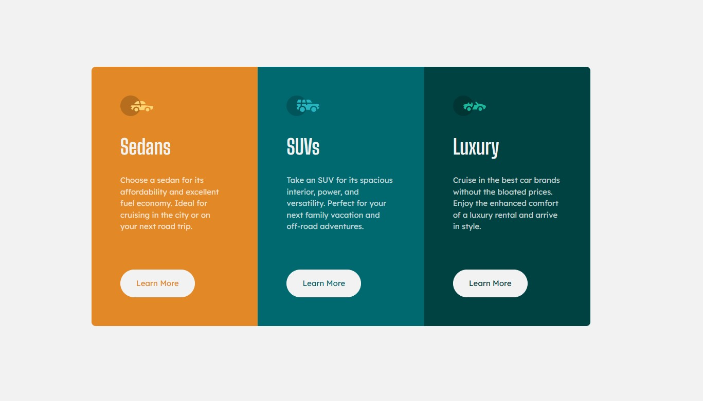

# Frontend Mentor - 3-column preview card component solution

This is a solution to the [3-column preview card component challenge on Frontend Mentor](https://www.frontendmentor.io/challenges/3column-preview-card-component-pH92eAR2-). Frontend Mentor challenges help you improve your coding skills by building realistic projects.

## Table of contents

- [Overview](#overview)
  - [The challenge](#the-challenge)
  - [Screenshot](#screenshot)
  - [Links](#links)
- [My process](#my-process)
  - [Built with](#built-with)
  - [What I learned](#what-i-learned)
  - [Continued development](#continued-development)
  - [Useful resources](#useful-resources)
- [Author](#author)

## Overview

### The challenge

Users should be able to:

- View the optimal layout depending on their device's screen size
- See hover states for interactive elements

### Screenshot



### Links

- Solution URL: [Github](https://your-solution-url.com)
- Live Site URL: [Netlify](https://your-live-site-url.com)

## My process

### Built with

- Semantic HTML5 markup
- CSS custom properties
- Flexbox
- CSS Grid
- Mobile-first workflow

### What I learned

This challenge mostly served to reinforce what I've already learned, but I did try something new That I would like to continue doing in the future.
I learned how to use helper classes to style components. It reminds me of how libraries like bootstrap function. Using classes like card\_\_category and button to apply general styles, then
applying specific styles allowed me to write less code and greatly simplify the project.

```html
<div class="card__category sedan">
  <p class="category__heading">Sedans</p>
  <p>
    Choose a sedan for its affordability and excellent fuel economy. Ideal for
    cruising in the city or on your next road trip.
  </p>
  <div class="button">Learn More</div>
</div>
```

### Continued development

I would like to continue this process of simplification wherever possible. I'd like to become proficient at visually breaking down layouts into reusable components.

### Useful resources

- [Example resource 1](https://www.example.com) - This helped me for XYZ reason. I really liked this pattern and will use it going forward.
- [Example resource 2](https://www.example.com) - This is an amazing article which helped me finally understand XYZ. I'd recommend it to anyone still learning this concept.

**Note: Delete this note and replace the list above with resources that helped you during the challenge. These could come in handy for anyone viewing your solution or for yourself when you look back on this project in the future.**

## Author

- Frontend Mentor - [@Moses2308](https://www.frontendmentor.io/profile/Moses2308)
- Dev - (https://dev.to/moses2308)
